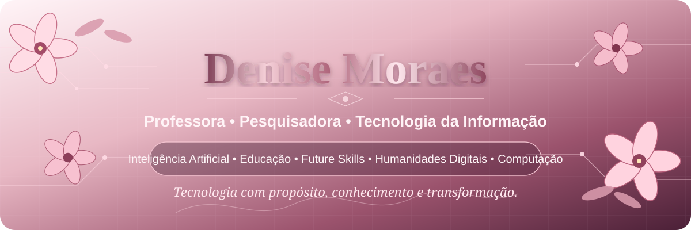

 

# Denise Moraes

### Professora • Pesquisadora • Tecnologia da Informação

**Inteligência Artificial • Educação • Future Skills • Humanidades Digitais • Computação**

---

## 🌸 Sobre mim

Sou professora, pesquisadora e profissional de Tecnologia da Informação, com atuação na interface entre **Computação, Educação e inovação**.

Meu trabalho acadêmico e tecnológico busca aproximar recursos computacionais de problemas educacionais reais, explorando especialmente **Inteligência Artificial, Educação Digital, Humanidades Digitais, Ciência de Dados e desenvolvimento de soluções educacionais**.

Tenho interesse em projetos que transformem tecnologia em conhecimento aplicável, valorizando pesquisa, formação, pensamento crítico e impacto social.

> **Tecnologia com propósito, conhecimento e transformação.**

---

## ✨ Áreas de interesse

- Inteligência Artificial aplicada à Educação
- Educação Digital e Pensamento Computacional
- Humanidades Digitais
- Ciência de Dados e análise documental
- Processamento de Linguagem Natural
- Desenvolvimento de aplicações educacionais
- Future Skills e formação para o mundo contemporâneo

---

## 💻 Tecnologias e ferramentas

---

## 🔬 Pesquisa e projetos

### 🌍 Diretrizes Internacionais da Educação

Projeto dedicado à **análise comparativa de diretrizes educacionais internacionais**, com apoio de métodos computacionais para organização, recuperação e análise de documentos.

**Eixos de investigação:** Educação Comparada, Computação na Educação, Educação Digital, competências, Future Skills e Humanidades Digitais.

### 🤖 Projetos em Inteligência Artificial e Computação

Também desenvolvo experimentos, aplicações e materiais relacionados à Inteligência Artificial, programação, análise de dados e ensino de Computação.

---

## 📊 GitHub

---

### 🌷 Educação e tecnologia também podem florescer juntas.

Perfil acadêmico e tecnológico de Denise Moraes

